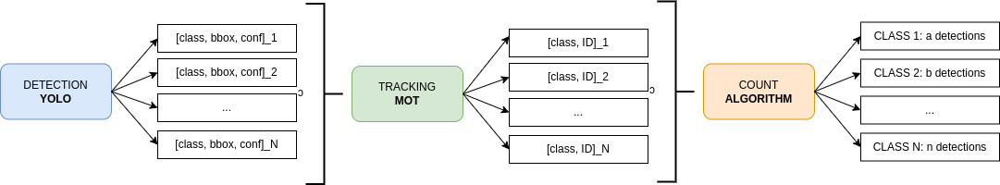
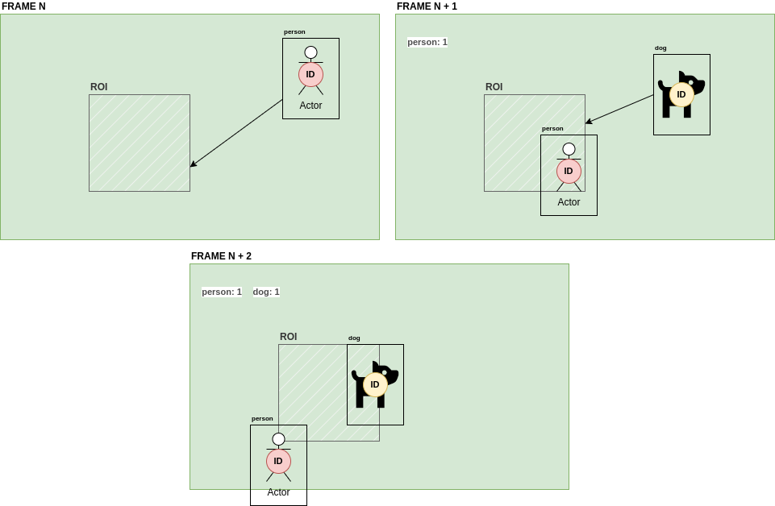

# YoloV7 | DeepSort and Count

**#ComputerVision** **#RealTimeDetection** **#RealTimeCounting** **#DeepLearning** **#DeepSort** **#MachineLearning** **#AI** **#OpenCV** **#Python** **#YOLO** **#MOT #Docker** **#DigitalImageProcessing**


## Principal idea

This project started with the idea of being able **to help farm workers who still count cattle by hand.**

Starting with this idea, for a project on Digital Image Processing at the [National University of Río Cuarto](https://www.unrc.edu.ar/), my research began to achieve the first objective.

As the project developed, I realized that I could further generalize its scope. It wouldn't just be cattle, but could be any class, as long as we can train the detection model.

I have managed to **make detections in "real time" (almost 30 FPS)** with videos or images from different types of sources.

In addition to the detections, **it has been possible to track these objects and detect when they enter a certain region of interest (ROI)** defined by the user **and make a count by class independently** detected, for example:

- person: 2; car: 5.

### Information flow



### Count algorithm



## Results

- One class
    - Source: YouTube
    - Invert Frame: False
    - Classes: car → [2]


### Test environment

I’ve done tests with:

- **PC:** HP-OMEN ce004-la
- **GPU:** NVIDIA 1060 MAX-Q DESIGN 6GB
- **CPU:** INTEL I7 7700HQ
- **RAM:** 16GB
- **DISK:** SSD M2

## Performance

- I’ve obtained almost **30 FPS (detection + tracking time**) in the majority of the tests.
- Performance suffers when the number of concurrent detections per frame rises above 10/20. We can suffer a drop in fps (detection + tracking) to about 5 per second.


## Problems

- You need a lot of processing capacity.
- Occlusion it is a problem (when the objects are too close)
- When an object get out of the frame we lost the tracking and then the program consider a new object if this come into the frame again.


## Ideas for the future

- You can create an **API.**
- You can **re-train the detection model with your own class/classes** and run the program.
- You can add an **visual interface.**
- You can **collaborate on this repository** integrating new features or solving bugs!

---
## Try it yourself. Do a test!

### Warnings

- **NVIDIA Graphic Card** needed to run this project.
- **Docker** previously installed in your computer.
- **NVIDIA Docker image** needed.

### Configuring your HOST PC

Do this following steps *in order.*

**Install Docker**

1. [Install Docker](https://docs.docker.com/engine/install/ubuntu/)

2. [Post-Install](https://docs.docker.com/engine/install/linux-postinstall/)

**Install Nvidia Drivers**

- Instalation:
    
    ```bash
    ubuntu-drivers devices # To know which driver is recommended
    sudo ubuntu-drivers autoinstall # To automatically install the recommended driver
    reboot # We need to reboot the system after the installation
    ```
    

- Checks:
    
    ```bash
    nvidia-smi # Command to check if the driver was installed correctly: The output must be a list of GPU's and a list processes running on it
    sudo apt install nvtop # Program to check the GPU usage
    nvtop # To run the nvtop
    ```

    

**Pull nvidia-gpu image**

Follow this  **[installation guide.](https://docs.nvidia.com/datacenter/cloud-native/container-toolkit/install-guide.html)**

**Pull this repository**

```bash
git pull https://github.com/aagustinconti/yolov7_counting
```


**Download YOLOv7x pretrained weights**

1. Download the pretrained weights of YOLOv7x [here.](https://github.com/WongKinYiu/yolov7/blob/main/README.md#performance)
2. Save them in **./pretrained_weights** directory.


**Configuring the test**

- Into the **test_oop.py** file you can modify some characteristics of the instance of the class *YoloSortCount()* before to execute the *run()* method.
    - By default:
        - Source: WebCamera (0)
        - Invert frame: True
        - Classes: person (ID: 0)
        - Save: False


**RUN docker_control.py**

To build the docker image if it's not available in your PC and run the container with the propp

```bash
python3 docker_control.py
```


## Thanks to

[YOLOv7](https://github.com/WongKinYiu/yolov7/)

[SORT Algorithm](https://github.com/dongdv95/yolov5/blob/master/Yolov5_DeepSort_Pytorch/track.py)